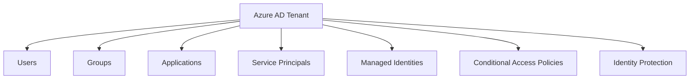

# Azure Identity Fundamentals

## Overview

Azure Identity is one of the most critical yet often misunderstood components in cloud architecture. As a principal architect, I've seen countless production issues stem from improper identity management. This guide provides extreme depth on Azure Identity concepts, implementations, and best practices.

## Core Concepts

### Authentication vs Authorization

**Authentication** (AuthN): Proving who you are
- Username/password
- Certificates
- Tokens
- Biometrics

**Authorization** (AuthZ): What you're allowed to do
- Role-Based Access Control (RBAC)
- Attribute-Based Access Control (ABAC)
- Claims-based authorization

### Identity Types in Azure

#### 1. User Identities
- Azure AD users
- Guest users
- Service principals
- Managed identities

#### 2. Application Identities
- App registrations
- Service principals
- Managed identities for resources

## Azure Active Directory Deep Dive

### Tenant Architecture



### User and Group Management

#### Creating Users Programmatically

```csharp
using Azure.Identity;
using Microsoft.Graph;
using Microsoft.Graph.Models;

public class UserManagementService
{
    private readonly GraphServiceClient _graphClient;

    public UserManagementService()
    {
        var credential = new DefaultAzureCredential();
        _graphClient = new GraphServiceClient(credential);
    }

    public async Task<User> CreateUserAsync(string displayName, string mailNickname, string password)
    {
        var user = new User
        {
            DisplayName = displayName,
            MailNickname = mailNickname,
            UserPrincipalName = $"{mailNickname}@{_tenantDomain}",
            PasswordProfile = new PasswordProfile
            {
                Password = password,
                ForceChangePasswordNextSignIn = true
            },
            AccountEnabled = true
        };

        return await _graphClient.Users.PostAsync(user);
    }
}
```

#### Group Management and Dynamic Groups

```csharp
public async Task<Group> CreateDynamicGroupAsync(string displayName, string membershipRule)
{
    var group = new Group
    {
        DisplayName = displayName,
        MailNickname = displayName.ToLower().Replace(" ", ""),
        SecurityEnabled = true,
        MailEnabled = false,
        GroupTypes = new List<string> { "DynamicMembership" },
        MembershipRule = membershipRule, // e.g., "(user.department -eq \"Engineering\")"
        MembershipRuleProcessingState = "On"
    };

    return await _graphClient.Groups.PostAsync(group);
}
```

### Application Registrations

#### Creating App Registrations

```csharp
public async Task<Application> RegisterApplicationAsync(string displayName, string[] redirectUris)
{
    var application = new Application
    {
        DisplayName = displayName,
        Web = new WebApplication
        {
            RedirectUris = redirectUris.ToList(),
            ImplicitGrantSettings = new ImplicitGrantSettings
            {
                EnableIdTokenIssuance = true,
                EnableAccessTokenIssuance = false
            }
        },
        RequiredResourceAccess = new List<RequiredResourceAccess>
        {
            new RequiredResourceAccess
            {
                ResourceAppId = "00000003-0000-0000-c000-000000000000", // Microsoft Graph
                ResourceAccess = new List<ResourceAccess>
                {
                    new ResourceAccess { Id = "e1fe6dd8-ba31-4d61-89e7-88639da4683d", Type = "Scope" } // User.Read
                }
            }
        }
    };

    return await _graphClient.Applications.PostAsync(application);
}
```

### Service Principals

#### Service Principal Creation and Management

```csharp
public async Task<ServicePrincipal> CreateServicePrincipalAsync(string appId)
{
    var servicePrincipal = new ServicePrincipal
    {
        AppId = appId,
        AccountEnabled = true,
        AppRoleAssignmentRequired = false
    };

    return await _graphClient.ServicePrincipals.PostAsync(servicePrincipal);
}
```

#### Certificate-Based Authentication

```csharp
// For service principals
public async Task AddCertificateToServicePrincipalAsync(string spId, X509Certificate2 certificate)
{
    var keyCredential = new KeyCredential
    {
        Type = "AsymmetricX509Cert",
        Usage = "Verify",
        Key = certificate.RawData,
        StartDateTime = certificate.NotBefore,
        EndDateTime = certificate.NotAfter
    };

    var sp = await _graphClient.ServicePrincipals[spId].GetAsync();
    sp.KeyCredentials ??= new List<KeyCredential>();
    sp.KeyCredentials.Add(keyCredential);

    await _graphClient.ServicePrincipals[spId].PatchAsync(sp);
}
```

## Managed Identities

### System-Assigned vs User-Assigned

#### System-Assigned Managed Identity

```csharp
// Enable system-assigned MI via ARM template
{
    "type": "Microsoft.Web/sites",
    "apiVersion": "2021-02-01",
    "name": "[variables('webAppName')]",
    "location": "[resourceGroup().location]",
    "identity": {
        "type": "SystemAssigned"
    },
    "properties": {
        // ... other properties
    }
}
```

#### User-Assigned Managed Identity

```csharp
// Create user-assigned MI
{
    "type": "Microsoft.ManagedIdentity/userAssignedIdentities",
    "apiVersion": "2018-11-30",
    "name": "[variables('identityName')]",
    "location": "[resourceGroup().location]"
}

// Assign to resource
{
    "type": "Microsoft.Web/sites",
    "apiVersion": "2021-02-01",
    "name": "[variables('webAppName')]",
    "location": "[resourceGroup().location]",
    "identity": {
        "type": "UserAssigned",
        "userAssignedIdentities": {
            "[resourceId('Microsoft.ManagedIdentity/userAssignedIdentities', variables('identityName'))]": {}
        }
    }
}
```

### Using Managed Identities in Code

```csharp
public class KeyVaultService
{
    private readonly SecretClient _secretClient;

    public KeyVaultService(IConfiguration configuration)
    {
        var keyVaultUrl = configuration["KeyVaultUrl"];
        var credential = new DefaultAzureCredential();
        _secretClient = new SecretClient(new Uri(keyVaultUrl), credential);
    }

    public async Task<string> GetSecretAsync(string secretName)
    {
        var secret = await _secretClient.GetSecretAsync(secretName);
        return secret.Value.Value;
    }
}
```

## Role-Based Access Control (RBAC)

### Built-in Roles vs Custom Roles

#### Custom Role Definition

```json
{
    "Name": "Custom Application Operator",
    "Id": null,
    "IsCustom": true,
    "Description": "Can manage applications but not users",
    "Actions": [
        "Microsoft.Authorization/*/read",
        "Microsoft.Graph/applications/*",
        "Microsoft.Graph/servicePrincipals/*"
    ],
    "NotActions": [
        "Microsoft.Graph/users/*",
        "Microsoft.Graph/groups/*"
    ],
    "AssignableScopes": [
        "/subscriptions/xxxxxxxx-xxxx-xxxx-xxxx-xxxxxxxxxxxx"
    ]
}
```

#### Role Assignment

```csharp
public async Task AssignRoleToServicePrincipalAsync(string spId, string roleDefinitionId, string scope)
{
    var roleAssignment = new RoleAssignment
    {
        PrincipalId = spId,
        RoleDefinitionId = roleDefinitionId,
        Scope = scope
    };

    // Using Azure Management SDK
    var credential = new DefaultAzureCredential();
    var client = new AuthorizationManagementClient(credential)
    {
        SubscriptionId = "your-subscription-id"
    };

    await client.RoleAssignments.CreateAsync(scope, Guid.NewGuid().ToString(), roleAssignment);
}
```

## Conditional Access Policies

### Policy Components

```csharp
// Conditional Access Policy structure
public class ConditionalAccessPolicy
{
    public string Id { get; set; }
    public string DisplayName { get; set; }
    public List<string> IncludeUsers { get; set; }
    public List<string> ExcludeUsers { get; set; }
    public List<ConditionalAccessCondition> Conditions { get; set; }
    public ConditionalAccessGrantControls GrantControls { get; set; }
    public string State { get; set; }
}

public class ConditionalAccessCondition
{
    public ConditionalAccessApplications Applications { get; set; }
    public ConditionalAccessUsers Users { get; set; }
    public ConditionalAccessLocations Locations { get; set; }
    public ConditionalAccessPlatforms Platforms { get; set; }
    public RiskLevel SignInRiskLevel { get; set; }
    public RiskLevel UserRiskLevel { get; set; }
}
```

### Implementing Risk-Based Policies

```csharp
public async Task CreateRiskBasedCAPolicyAsync()
{
    var policy = new ConditionalAccessPolicy
    {
        DisplayName = "Block High Risk Sign-ins",
        State = "enabled",
        Conditions = new List<ConditionalAccessCondition>
        {
            new ConditionalAccessCondition
            {
                Applications = new ConditionalAccessApplications
                {
                    IncludeApplications = new List<string> { "All" }
                },
                Users = new ConditionalAccessUsers
                {
                    IncludeUsers = new List<string> { "All" }
                },
                SignInRiskLevel = RiskLevel.High
            }
        },
        GrantControls = new ConditionalAccessGrantControls
        {
            Operator = "OR",
            BuiltInControls = new List<string> { "block" }
        }
    };

    // Create via Microsoft Graph
    await _graphClient.Identity.ConditionalAccess.Policies.PostAsync(policy);
}
```

## Identity Protection

### Risk Detection and Remediation

```csharp
public class IdentityProtectionService
{
    private readonly GraphServiceClient _graphClient;

    public async Task<List<RiskyUser>> GetRiskyUsersAsync()
    {
        var riskyUsers = await _graphClient.IdentityProtection.RiskyUsers.GetAsync();
        return riskyUsers.Value;
    }

    public async Task MitigateUserRiskAsync(string userId)
    {
        var riskRemediation = new RiskyUser
        {
            Id = userId,
            UserDisplayName = "User Name",
            UserPrincipalName = "user@domain.com",
            RiskState = RiskState.Remediated
        };

        await _graphClient.IdentityProtection.RiskyUsers[userId].PatchAsync(riskRemediation);
    }
}
```

## Azure AD B2B and B2C

### B2B Collaboration

```csharp
public async Task InviteExternalUserAsync(string email, string displayName, string redirectUrl)
{
    var invitation = new Invitation
    {
        InvitedUserEmailAddress = email,
        InvitedUserDisplayName = displayName,
        InviteRedirectUrl = redirectUrl,
        SendInvitationMessage = true,
        InvitedUserMessageInfo = new InvitedUserMessageInfo
        {
            CustomizedMessageBody = "Welcome to our organization!"
        }
    };

    await _graphClient.Invitations.PostAsync(invitation);
}
```

### B2C Custom Policies

```xml
<!-- TrustFrameworkPolicy -->
<TrustFrameworkPolicy xmlns:xsi="http://www.w3.org/2001/XMLSchema-instance"
    xmlns:xsd="http://www.w3.org/2001/XMLSchema"
    xmlns="http://schemas.microsoft.com/online/cpim/schemas/2013/06"
    PolicySchemaVersion="0.3.0.0"
    TenantId="yourtenant.onmicrosoft.com"
    PolicyId="B2C_1A_CustomSignUpSignIn"
    PublicPolicyUri="http://yourtenant.onmicrosoft.com/B2C_1A_CustomSignUpSignIn">

    <BasePolicy>
        <TenantId>yourtenant.onmicrosoft.com</TenantId>
        <PolicyId>B2C_1A_TrustFrameworkExtensions</PolicyId>
    </BasePolicy>

    <RelyingParty>
        <DefaultUserJourney ReferenceId="CustomSignUpSignIn" />
        <TechnicalProfile Id="PolicyProfile">
            <DisplayName>PolicyProfile</DisplayName>
            <Protocol Name="OpenIdConnect" />
            <OutputClaims>
                <OutputClaim ClaimTypeReferenceId="displayName" />
                <OutputClaim ClaimTypeReferenceId="givenName" />
                <OutputClaim ClaimTypeReferenceId="surname" />
                <OutputClaim ClaimTypeReferenceId="email" />
                <OutputClaim ClaimTypeReferenceId="objectId" PartnerClaimType="sub"/>
            </OutputClaims>
            <SubjectNamingInfo ClaimType="sub" />
        </TechnicalProfile>
    </RelyingParty>
</TrustFrameworkPolicy>
```

## Security Best Practices

### 1. Principle of Least Privilege
- Assign minimal required permissions
- Use role-based access instead of user-based
- Regularly review and rotate credentials

### 2. Multi-Factor Authentication
- Enforce MFA for all users
- Use conditional access to require MFA for high-risk scenarios
- Implement risk-based MFA

### 3. Certificate Management
- Use certificate-based authentication for service principals
- Implement certificate rotation policies
- Store certificates in Azure Key Vault

### 4. Monitoring and Auditing
- Enable Azure AD audit logs
- Monitor sign-in activities
- Set up alerts for suspicious activities

### 5. Secure Application Development
```csharp
// Secure token handling
public class SecureTokenService
{
    public async Task<string> GetAccessTokenAsync()
    {
        var credential = new DefaultAzureCredential();
        var tokenRequestContext = new TokenRequestContext(new[] { "https://graph.microsoft.com/.default" });
        var token = await credential.GetTokenAsync(tokenRequestContext);
        return token.Token;
    }
}

// Secure password handling
public class PasswordService
{
    public string HashPassword(string password)
    {
        return BCrypt.Net.BCrypt.HashPassword(password, BCrypt.Net.BCrypt.GenerateSalt(12));
    }

    public bool VerifyPassword(string password, string hash)
    {
        return BCrypt.Net.BCrypt.Verify(password, hash);
    }
}
```

## Common Pitfalls and Solutions

### 1. Over-Provisioning Permissions
**Problem**: Granting excessive permissions leading to security risks
**Solution**: Implement just-in-time access and regular permission reviews

### 2. Ignoring Managed Identities
**Problem**: Using service principal secrets in code
**Solution**: Always prefer managed identities for Azure resources

### 3. Not Monitoring Identity Activities
**Problem**: Failing to detect unauthorized access
**Solution**: Implement comprehensive logging and alerting

### 4. Weak Password Policies
**Problem**: Allowing weak passwords
**Solution**: Enforce strong password requirements and regular rotation

## Advanced Scenarios

### Cross-Tenant Identity Management

```csharp
public async Task SetupCrossTenantAccessAsync(string resourceTenantId, string clientTenantId)
{
    // Configure resource tenant
    var crossTenantAccessPolicy = new CrossTenantAccessPolicy
    {
        AllowedCloudEndpoints = new List<string> { "microsoftonline.com" },
        B2BCollaborationInbound = new CrossTenantAccessPolicyB2BSetting
        {
            Applications = new CrossTenantAccessPolicyTarget
            {
                AccessType = "allowed",
                Targets = new List<CrossTenantAccessPolicyTargetConfiguration>
                {
                    new CrossTenantAccessPolicyTargetConfiguration
                    {
                        Target = clientTenantId,
                        TargetType = "tenant"
                    }
                }
            }
        }
    };

    await _graphClient.Policies.CrossTenantAccessPolicy.PutAsync(crossTenantAccessPolicy);
}
```

### Identity Federation

```csharp
// SAML-based federation
public async Task ConfigureSamlFederationAsync(string domainName, string issuer, string loginUrl)
{
    var domain = new Domain
    {
        Id = domainName,
        AuthenticationType = "Federated",
        FederationConfiguration = new InternalDomainFederation
        {
            IssuerUri = issuer,
            SigningCertificate = "MIICiT...",
            PassiveSignInUri = loginUrl,
            PreferredAuthenticationProtocol = "wsFed"
        }
    };

    await _graphClient.Domains[domainName].PatchAsync(domain);
}
```

## Summary

Azure Identity is the foundation of secure cloud applications. Understanding these concepts deeply will prevent security breaches and ensure scalable, maintainable systems. Always implement defense-in-depth strategies and regularly audit your identity configurations.

**Key Takeaways:**
- Use managed identities whenever possible
- Implement least privilege access
- Enable MFA and conditional access
- Monitor identity activities continuously
- Rotate credentials and certificates regularly
- Use Azure AD for centralized identity management