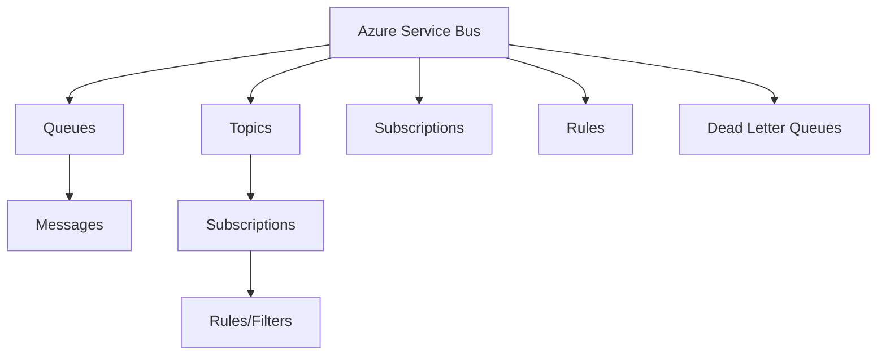
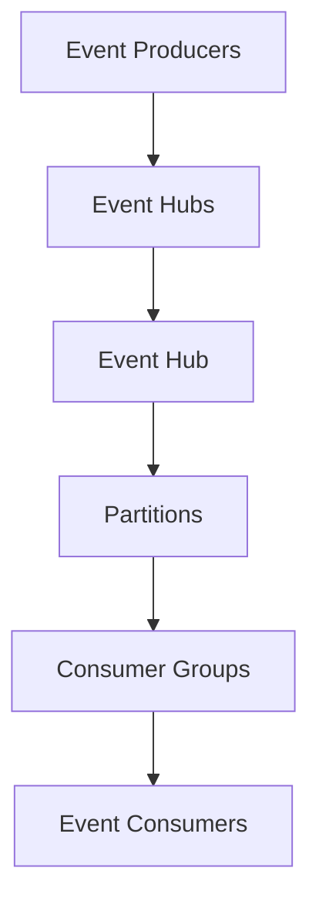
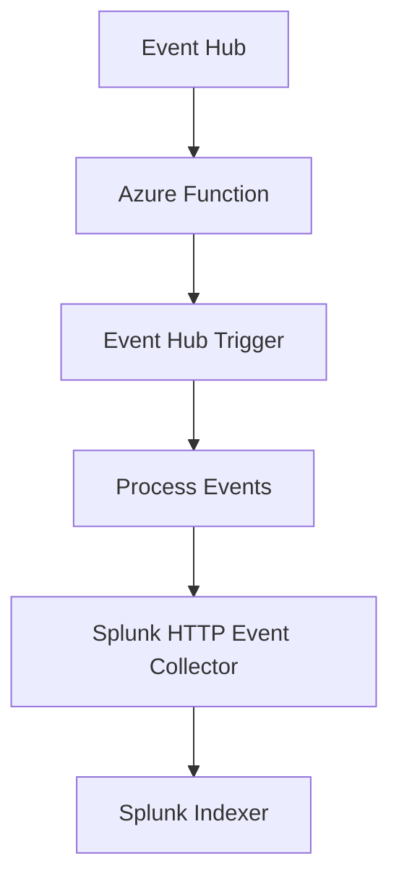

# Azure Messaging Services

## Overview

Azure provides a comprehensive suite of messaging services for different communication patterns. This guide covers Service Bus, Storage Queues, and Event Hubs, including integration patterns and Splunk connectivity for enterprise monitoring.

## Azure Service Bus

### Architecture Overview

Service Bus is a fully managed enterprise message broker supporting both cloud and hybrid scenarios.

#### Key Components



### Queues

#### Creating and Managing Queues

```csharp
using Azure.Messaging.ServiceBus;
using Azure.Messaging.ServiceBus.Administration;

public class ServiceBusQueueManager
{
    private readonly ServiceBusAdministrationClient _adminClient;
    private readonly ServiceBusClient _client;

    public ServiceBusQueueManager(string connectionString)
    {
        _adminClient = new ServiceBusAdministrationClient(connectionString);
        _client = new ServiceBusClient(connectionString);
    }

    public async Task CreateQueueAsync(string queueName)
    {
        var options = new CreateQueueOptions(queueName)
        {
            MaxDeliveryCount = 3,
            LockDuration = TimeSpan.FromMinutes(5),
            DefaultMessageTimeToLive = TimeSpan.FromDays(7),
            EnableDeadLetteringOnMessageExpiration = true,
            EnablePartitioning = true,
            MaxSizeInMegabytes = 1024
        };

        await _adminClient.CreateQueueAsync(options);
    }

    public async Task SendMessageAsync(string queueName, string messageBody)
    {
        await using var sender = _client.CreateSender(queueName);
        
        var message = new ServiceBusMessage(messageBody)
        {
            TimeToLive = TimeSpan.FromHours(1),
            Subject = "Order Processing"
        };

        await sender.SendMessageAsync(message);
    }

    public async Task ReceiveMessagesAsync(string queueName)
    {
        await using var processor = _client.CreateProcessor(queueName);
        
        processor.ProcessMessageAsync += MessageHandler;
        processor.ProcessErrorAsync += ErrorHandler;

        await processor.StartProcessingAsync();
        
        // Keep processing for a while
        await Task.Delay(TimeSpan.FromMinutes(5));
        
        await processor.StopProcessingAsync();
    }

    private async Task MessageHandler(ProcessMessageEventArgs args)
    {
        var body = args.Message.Body.ToString();
        Console.WriteLine($"Received: {body}");
        
        // Complete the message
        await args.CompleteMessageAsync(args.Message);
    }

    private Task ErrorHandler(ProcessErrorEventArgs args)
    {
        Console.WriteLine($"Error: {args.Exception.Message}");
        return Task.CompletedTask;
    }
}
```

#### Advanced Queue Patterns

```csharp
public class AdvancedQueueOperations
{
    private readonly ServiceBusClient _client;

    public async Task SendScheduledMessageAsync(string queueName, string message, DateTimeOffset scheduleTime)
    {
        await using var sender = _client.CreateSender(queueName);
        
        var serviceBusMessage = new ServiceBusMessage(message)
        {
            ScheduledEnqueueTime = scheduleTime
        };

        await sender.SendMessageAsync(serviceBusMessage);
    }

    public async Task SendBatchMessagesAsync(string queueName, IEnumerable<string> messages)
    {
        await using var sender = _client.CreateSender(queueName);
        
        var batch = await sender.CreateMessageBatchAsync();
        
        foreach (var message in messages)
        {
            var serviceBusMessage = new ServiceBusMessage(message);
            
            if (!batch.TryAddMessage(serviceBusMessage))
            {
                // Send the current batch and create a new one
                await sender.SendMessagesAsync(batch);
                batch = await sender.CreateMessageBatchAsync();
                batch.TryAddMessage(serviceBusMessage);
            }
        }

        // Send remaining messages
        if (batch.Count > 0)
        {
            await sender.SendMessagesAsync(batch);
        }
    }

    public async Task PeekMessagesAsync(string queueName, int maxMessages = 10)
    {
        await using var receiver = _client.CreateReceiver(queueName);
        
        var messages = await receiver.PeekMessagesAsync(maxMessages);
        
        foreach (var message in messages)
        {
            Console.WriteLine($"Peeked: {message.Body}");
        }
    }
}
```

### Topics and Subscriptions

```csharp
public class TopicManager
{
    private readonly ServiceBusAdministrationClient _adminClient;
    private readonly ServiceBusClient _client;

    public async Task CreateTopicAsync(string topicName)
    {
        var options = new CreateTopicOptions(topicName)
        {
            MaxSizeInMegabytes = 1024,
            DefaultMessageTimeToLive = TimeSpan.FromDays(7),
            EnablePartitioning = true
        };

        await _adminClient.CreateTopicAsync(options);
    }

    public async Task CreateSubscriptionAsync(string topicName, string subscriptionName, string filter = null)
    {
        var options = new CreateSubscriptionOptions(topicName, subscriptionName)
        {
            LockDuration = TimeSpan.FromMinutes(5),
            MaxDeliveryCount = 3,
            EnableDeadLetteringOnFilterEvaluationExceptions = true
        };

        var subscription = await _adminClient.CreateSubscriptionAsync(options);

        if (!string.IsNullOrEmpty(filter))
        {
            var ruleOptions = new CreateRuleOptions("CustomFilter", new SqlRuleFilter(filter));
            await _adminClient.CreateRuleAsync(topicName, subscriptionName, ruleOptions);
        }
    }

    public async Task PublishToTopicAsync(string topicName, string message, string category)
    {
        await using var sender = _client.CreateSender(topicName);
        
        var serviceBusMessage = new ServiceBusMessage(message)
        {
            Subject = category,
            ApplicationProperties = { { "Category", category } }
        };

        await sender.SendMessageAsync(serviceBusMessage);
    }

    public async Task SubscribeToTopicAsync(string topicName, string subscriptionName)
    {
        await using var processor = _client.CreateProcessor(topicName, subscriptionName);
        
        processor.ProcessMessageAsync += async (args) =>
        {
            var category = args.Message.ApplicationProperties["Category"].ToString();
            Console.WriteLine($"Received {category}: {args.Message.Body}");
            await args.CompleteMessageAsync(args.Message);
        };

        await processor.StartProcessingAsync();
        await Task.Delay(TimeSpan.FromMinutes(5));
        await processor.StopProcessingAsync();
    }
}
```

## Azure Storage Queues

### When to Use Storage Queues vs Service Bus

- **Storage Queues**: Simple, cost-effective, best for basic messaging
- **Service Bus**: Advanced features, transactions, complex routing

```csharp
using Azure.Storage.Queues;

public class StorageQueueManager
{
    private readonly QueueClient _queueClient;

    public StorageQueueManager(string connectionString, string queueName)
    {
        _queueClient = new QueueClient(connectionString, queueName);
        _queueClient.CreateIfNotExists();
    }

    public async Task SendMessageAsync(string message)
    {
        await _queueClient.SendMessageAsync(message);
    }

    public async Task SendMessageWithVisibilityTimeoutAsync(string message, TimeSpan visibilityTimeout)
    {
        await _queueClient.SendMessageAsync(message, visibilityTimeout: visibilityTimeout);
    }

    public async Task<QueueMessage[]> ReceiveMessagesAsync(int maxMessages = 1)
    {
        var messages = await _queueClient.ReceiveMessagesAsync(maxMessages);
        return messages.Value;
    }

    public async Task DeleteMessageAsync(string messageId, string popReceipt)
    {
        await _queueClient.DeleteMessageAsync(messageId, popReceipt);
    }

    public async Task UpdateMessageAsync(string messageId, string popReceipt, string updatedMessage, TimeSpan visibilityTimeout)
    {
        await _queueClient.UpdateMessageAsync(messageId, popReceipt, updatedMessage, visibilityTimeout);
    }
}
```

## Azure Event Hubs

### Event Hubs Architecture

Event Hubs is designed for high-throughput event streaming.



### Event Producer

```csharp
using Azure.Messaging.EventHubs;
using Azure.Messaging.EventHubs.Producer;

public class EventProducer
{
    private readonly EventHubProducerClient _producer;

    public EventProducer(string connectionString, string eventHubName)
    {
        _producer = new EventHubProducerClient(connectionString, eventHubName);
    }

    public async Task SendEventAsync(string eventData)
    {
        using var eventBatch = await _producer.CreateBatchAsync();
        
        var eventData = new EventData(Encoding.UTF8.GetBytes(eventData));
        eventData.Properties["EventType"] = "UserAction";
        
        eventBatch.TryAdd(eventData);
        
        await _producer.SendAsync(eventBatch);
    }

    public async Task SendEventsBatchAsync(IEnumerable<string> events)
    {
        using var eventBatch = await _producer.CreateBatchAsync();
        
        foreach (var eventItem in events)
        {
            var eventData = new EventData(Encoding.UTF8.GetBytes(eventItem));
            eventData.Properties["BatchId"] = Guid.NewGuid().ToString();
            
            if (!eventBatch.TryAdd(eventData))
            {
                // Send current batch and create new one
                await _producer.SendAsync(eventBatch);
                eventBatch = await _producer.CreateBatchAsync();
                eventBatch.TryAdd(eventData);
            }
        }

        // Send remaining events
        if (eventBatch.Count > 0)
        {
            await _producer.SendAsync(eventBatch);
        }
    }
}
```

### Event Consumer

```csharp
using Azure.Messaging.EventHubs.Consumer;

public class EventConsumer
{
    private readonly EventHubConsumerClient _consumer;

    public EventConsumer(string connectionString, string eventHubName, string consumerGroup = "$Default")
    {
        _consumer = new EventHubConsumerClient(consumerGroup, connectionString, eventHubName);
    }

    public async Task ReadEventsAsync()
    {
        await foreach (var partitionEvent in _consumer.ReadEventsAsync())
        {
            var eventData = partitionEvent.Data;
            var eventBody = Encoding.UTF8.GetString(eventData.EventBody.ToArray());
            
            Console.WriteLine($"Received event: {eventBody}");
            Console.WriteLine($"Partition: {partitionEvent.Partition.PartitionId}");
            Console.WriteLine($"Offset: {eventData.Offset}");
            Console.WriteLine($"Sequence Number: {eventData.SequenceNumber}");
        }
    }

    public async Task ReadEventsFromPositionAsync(EventPosition startingPosition)
    {
        var options = new ReadEventOptions
        {
            MaximumWaitTime = TimeSpan.FromSeconds(10)
        };

        await foreach (var partitionEvent in _consumer.ReadEventsAsync(startingPosition, options))
        {
            // Process event
            var eventData = partitionEvent.Data;
            // ... processing logic
        }
    }
}
```

### Partition Management

```csharp
public class PartitionManager
{
    private readonly EventHubConsumerClient _consumer;

    public async Task GetPartitionIdsAsync()
    {
        var partitionIds = await _consumer.GetPartitionIdsAsync();
        foreach (var partitionId in partitionIds)
        {
            Console.WriteLine($"Partition: {partitionId}");
        }
    }

    public async Task GetPartitionPropertiesAsync(string partitionId)
    {
        var properties = await _consumer.GetPartitionPropertiesAsync(partitionId);
        
        Console.WriteLine($"Partition ID: {properties.Id}");
        Console.WriteLine($"Beginning Sequence Number: {properties.BeginningSequenceNumber}");
        Console.WriteLine($"Last Enqueued Sequence Number: {properties.LastEnqueuedSequenceNumber}");
        Console.WriteLine($"Last Enqueued Offset: {properties.LastEnqueuedOffset}");
        Console.WriteLine($"Last Enqueued Time: {properties.LastEnqueuedTime}");
    }
}
```

## Event Hub to Splunk Integration

### Direct Integration Assessment

**Direct Connection**: Azure Event Hubs does not have a native direct connector to Splunk. The integration requires an intermediary service.

### Azure Function as Bridge

#### Function Architecture



#### Azure Function Implementation

```csharp
using Microsoft.Azure.WebJobs;
using Microsoft.Extensions.Logging;
using System.Net.Http;
using System.Text;
using System.Text.Json;

public class EventHubToSplunkFunction
{
    private readonly HttpClient _httpClient;
    private readonly string _splunkToken;
    private readonly string _splunkUrl;

    public EventHubToSplunkFunction(IHttpClientFactory httpClientFactory, IConfiguration config)
    {
        _httpClient = httpClientFactory.CreateClient();
        _splunkToken = config["SplunkToken"];
        _splunkUrl = config["SplunkUrl"]; // e.g., https://splunk-server:8088/services/collector
    }

    [FunctionName("EventHubToSplunk")]
    public async Task Run(
        [EventHubTrigger("myeventhub", Connection = "EventHubConnectionString")] EventData[] events,
        ILogger log)
    {
        foreach (var eventData in events)
        {
            try
            {
                var eventBody = Encoding.UTF8.GetString(eventData.EventBody.ToArray());
                var splunkEvent = CreateSplunkEvent(eventBody, eventData);
                
                await SendToSplunkAsync(splunkEvent);
                log.LogInformation($"Event sent to Splunk: {eventData.SequenceNumber}");
            }
            catch (Exception ex)
            {
                log.LogError(ex, $"Error processing event {eventData.SequenceNumber}");
            }
        }
    }

    private SplunkEvent CreateSplunkEvent(string eventBody, EventData eventData)
    {
        return new SplunkEvent
        {
            Event = JsonSerializer.Deserialize<object>(eventBody),
            Time = eventData.EnqueuedTime.ToUnixTimeSeconds(),
            Host = Environment.GetEnvironmentVariable("WEBSITE_HOSTNAME"),
            Source = "azure-event-hub",
            Sourcetype = "json",
            Index = "azure-events"
        };
    }

    private async Task SendToSplunkAsync(SplunkEvent splunkEvent)
    {
        var json = JsonSerializer.Serialize(splunkEvent);
        var content = new StringContent(json, Encoding.UTF8, "application/json");
        
        _httpClient.DefaultRequestHeaders.Authorization = 
            new System.Net.Http.Headers.AuthenticationHeaderValue("Splunk", _splunkToken);

        var response = await _httpClient.PostAsync(_splunkUrl, content);
        response.EnsureSuccessStatusCode();
    }
}

public class SplunkEvent
{
    public object Event { get; set; }
    public long Time { get; set; }
    public string Host { get; set; }
    public string Source { get; set; }
    public string Sourcetype { get; set; }
    public string Index { get; set; }
}
```

#### Function Configuration (host.json)

```json
{
    "version": "2.0",
    "extensions": {
        "eventHubs": {
            "batchCheckpointFrequency": 1,
            "eventProcessorOptions": {
                "maxBatchSize": 100,
                "prefetchCount": 100
            }
        }
    }
}
```

#### ARM Template for Deployment

```json
{
    "$schema": "https://schema.management.azure.com/schemas/2019-04-01/deploymentTemplate.json#",
    "contentVersion": "1.0.0.0",
    "parameters": {
        "functionAppName": {
            "type": "string",
            "defaultValue": "[concat('func-', uniqueString(resourceGroup().id))]"
        },
        "eventHubNamespace": {
            "type": "string"
        },
        "eventHubName": {
            "type": "string"
        }
    },
    "resources": [
        {
            "type": "Microsoft.Web/sites",
            "apiVersion": "2021-02-01",
            "name": "[parameters('functionAppName')]",
            "location": "[resourceGroup().location]",
            "kind": "functionapp",
            "properties": {
                "serverFarmId": "[resourceId('Microsoft.Web/serverfarms', variables('appServicePlanName'))]",
                "siteConfig": {
                    "appSettings": [
                        {
                            "name": "AzureWebJobsStorage",
                            "value": "[concat('DefaultEndpointsProtocol=https;AccountName=', variables('storageAccountName'), ';AccountEndpoint=', variables('storageAccountEndpoint'))]"
                        },
                        {
                            "name": "EventHubConnectionString",
                            "value": "[listKeys(resourceId('Microsoft.EventHub/namespaces/eventhubs/authorizationRules', parameters('eventHubNamespace'), parameters('eventHubName'), 'RootManageSharedAccessKey'), '2017-04-01').primaryConnectionString]"
                        },
                        {
                            "name": "SplunkUrl",
                            "value": "https://your-splunk-server:8088/services/collector"
                        },
                        {
                            "name": "SplunkToken",
                            "value": "[parameters('splunkToken')]"
                        }
                    ]
                }
            }
        }
    ]
}
```

### Alternative Integration Patterns

#### 1. Azure Stream Analytics to Splunk

```sql
-- Stream Analytics query to transform Event Hub data
SELECT
    eventId,
    eventType,
    eventData,
    System.Timestamp as EventTime
INTO
    splunkOutput
FROM
    eventHubInput
WHERE
    eventType IN ('error', 'warning', 'info')
```

#### 2. Logic Apps Integration

```json
{
    "definition": {
        "$schema": "https://schema.management.azure.com/providers/Microsoft.Logic/schemas/2016-06-01/workflowdefinition.json#",
        "actions": {
            "ReceiveEvent": {
                "type": "ApiConnection",
                "inputs": {
                    "host": {
                        "connection": {
                            "name": "@parameters('$connections')['eventhubs']['connectionId']"
                        }
                    },
                    "method": "get",
                    "path": "/@{encodeURIComponent(encodeURIComponent('your-event-hub'))}/events/batch"
                }
            },
            "SendToSplunk": {
                "type": "Http",
                "inputs": {
                    "method": "POST",
                    "uri": "https://your-splunk-server:8088/services/collector",
                    "headers": {
                        "Authorization": "Splunk @{variables('splunkToken')}"
                    },
                    "body": "@{body('ReceiveEvent')}"
                }
            }
        }
    }
}
```

## Best Practices

### Service Bus Best Practices

```csharp
public class ServiceBusBestPractices
{
    // Use asynchronous processing
    public async Task ProcessMessagesAsync(string queueName)
    {
        await using var processor = _client.CreateProcessor(queueName, new ServiceBusProcessorOptions
        {
            MaxConcurrentCalls = 10,
            PrefetchCount = 20,
            AutoCompleteMessages = false
        });

        processor.ProcessMessageAsync += async (args) =>
        {
            try
            {
                // Process message
                await ProcessMessageAsync(args.Message);
                
                // Explicitly complete
                await args.CompleteMessageAsync(args.Message);
            }
            catch (Exception ex)
            {
                // Handle failure - could dead letter or abandon
                await args.AbandonMessageAsync(args.Message);
            }
        };

        await processor.StartProcessingAsync();
    }

    // Implement circuit breaker pattern
    private readonly CircuitBreaker _circuitBreaker = new CircuitBreaker();

    private async Task ProcessMessageAsync(ServiceBusReceivedMessage message)
    {
        if (_circuitBreaker.IsOpen)
        {
            await Task.Delay(_circuitBreaker.Timeout);
            return;
        }

        try
        {
            // Processing logic
            await DoWorkAsync(message);
            _circuitBreaker.RecordSuccess();
        }
        catch (Exception ex)
        {
            _circuitBreaker.RecordFailure();
            throw;
        }
    }
}
```

### Event Hubs Best Practices

```csharp
public class EventHubsBestPractices
{
    // Use EventDataBatch for efficient sending
    public async Task SendEventsEfficientlyAsync(IEnumerable<EventData> events)
    {
        var batches = events
            .Select((event, index) => new { Event = event, Index = index })
            .GroupBy(x => x.Index / 100) // Batch size of 100
            .Select(g => g.Select(x => x.Event));

        foreach (var batch in batches)
        {
            using var eventBatch = await _producer.CreateBatchAsync();
            
            foreach (var eventData in batch)
            {
                if (!eventBatch.TryAdd(eventData))
                {
                    await _producer.SendAsync(eventBatch);
                    eventBatch = await _producer.CreateBatchAsync();
                    eventBatch.TryAdd(eventData);
                }
            }

            if (eventBatch.Count > 0)
            {
                await _producer.SendAsync(eventBatch);
            }
        }
    }

    // Implement checkpointing for reliable processing
    public async Task ProcessEventsWithCheckpointingAsync()
    {
        var processor = new EventProcessorClient(
            _storageClient,
            _consumerGroup,
            _eventHubConnectionString,
            _eventHubName);

        processor.ProcessEventAsync += async (args) =>
        {
            try
            {
                // Process event
                await ProcessEventAsync(args.Data);
                
                // Checkpoint after successful processing
                await args.UpdateCheckpointAsync();
            }
            catch (Exception ex)
            {
                // Log error but don't checkpoint
                _logger.LogError(ex, "Failed to process event");
            }
        };

        await processor.StartProcessingAsync();
    }
}
```

## Monitoring and Observability

### Service Bus Monitoring

```csharp
public class ServiceBusMonitoring
{
    private readonly ServiceBusAdministrationClient _adminClient;

    public async Task MonitorQueueHealthAsync(string queueName)
    {
        var queue = await _adminClient.GetQueueRuntimePropertiesAsync(queueName);
        
        var metrics = new
        {
            ActiveMessages = queue.Value.ActiveMessageCount,
            DeadLetterMessages = queue.Value.DeadLetterMessageCount,
            ScheduledMessages = queue.Value.ScheduledMessageCount,
            TransferMessages = queue.Value.TransferMessageCount
        };

        // Send metrics to monitoring system
        await _metricsCollector.RecordMetricsAsync(metrics);
    }

    public async Task AlertOnQueueIssuesAsync(string queueName)
    {
        var properties = await _adminClient.GetQueueRuntimePropertiesAsync(queueName);
        
        if (properties.Value.DeadLetterMessageCount > 100)
        {
            await _alertService.SendAlertAsync(
                $"High dead letter count in queue {queueName}: {properties.Value.DeadLetterMessageCount}");
        }
    }
}
```

## Summary

Azure messaging services provide robust solutions for different communication patterns. Service Bus excels at reliable messaging with advanced features, Storage Queues offer simplicity, and Event Hubs handle high-throughput streaming. For Splunk integration, Azure Functions provide the most reliable bridge.

**Key Takeaways:**
- Choose the right service for your use case
- Implement proper error handling and dead lettering
- Use batching for performance optimization
- Monitor message flow and implement alerting
- Use Azure Functions for Event Hub to Splunk integration
- Implement checkpointing for reliable event processing