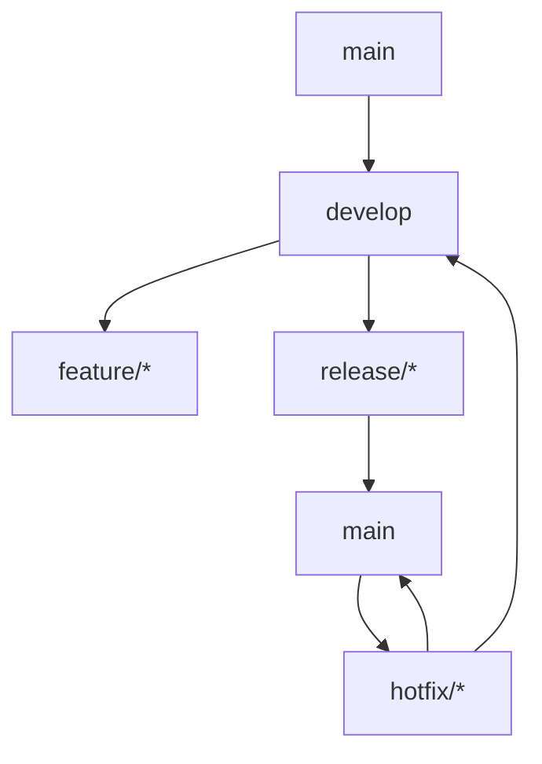
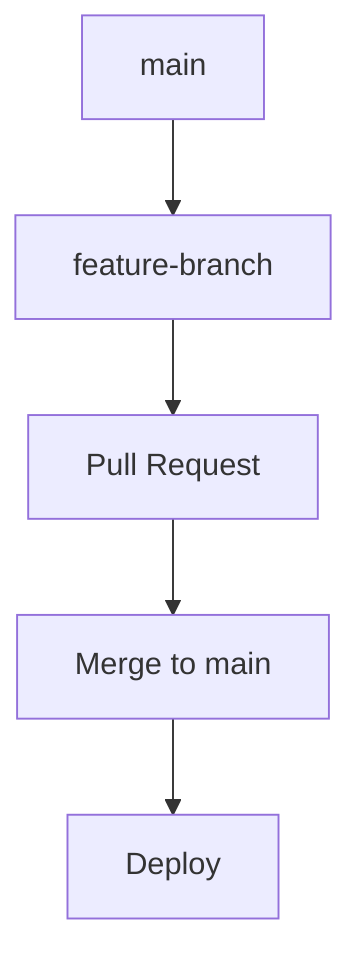
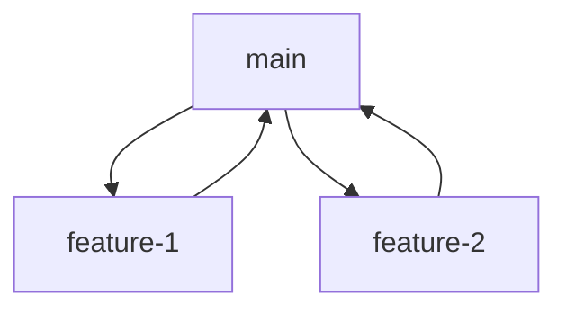

# Git Workflows and CI/CD

## Overview

Git workflows and CI/CD pipelines are essential for modern software development. This guide covers Git branching strategies, GitHub Actions, self-hosted runners, YAML pipeline configuration, and security best practices for handling sensitive data.

## Git Workflows

### Branching Strategies

#### 1. Git Flow

Git Flow is a branching model that defines a strict branching model designed around the project release.



**Commands:**
```bash
# Initialize Git Flow
git flow init

# Start a new feature
git flow feature start my-feature

# Finish a feature
git flow feature finish my-feature

# Start a release
git flow release start 1.0.0

# Finish a release
git flow release finish 1.0.0
```

#### 2. GitHub Flow

Simpler model used by GitHub, suitable for continuous deployment.



**Workflow:**
```bash
# Create feature branch
git checkout -b feature/my-feature

# Make changes and commit
git add .
git commit -m "Add my feature"

# Push and create PR
git push origin feature/my-feature

# After PR approval, merge
git checkout main
git merge feature/my-feature
git push origin main
```

#### 3. Trunk-Based Development

All developers work on a single branch (trunk/main), with short-lived feature branches.



### Git Best Practices

#### Commit Messages

```bash
# Good commit message format
type(scope): description

# Examples
feat(auth): add JWT token validation
fix(api): resolve null pointer in user service
docs(readme): update installation instructions
refactor(db): optimize query performance
test(unit): add tests for payment service
```

#### Branch Naming Conventions

```bash
# Feature branches
feature/add-user-authentication
feature/implement-payment-gateway

# Bug fixes
bugfix/fix-login-validation
hotfix/critical-security-patch

# Releases
release/v2.1.0
```

## GitHub Actions

### Workflow Fundamentals

GitHub Actions uses YAML files to define automation workflows.

#### Basic Workflow Structure

```yaml
name: CI/CD Pipeline

on:
  push:
    branches: [ main, develop ]
  pull_request:
    branches: [ main ]

jobs:
  build:
    runs-on: ubuntu-latest
    
    steps:
    - uses: actions/checkout@v4
    
    - name: Setup .NET
      uses: actions/setup-dotnet@v3
      with:
        dotnet-version: '8.0.x'
    
    - name: Restore dependencies
      run: dotnet restore
    
    - name: Build
      run: dotnet build --no-restore
    
    - name: Test
      run: dotnet test --no-build --verbosity normal
```

### Advanced Workflow Patterns

#### Matrix Builds

```yaml
name: Matrix Build

on: [push]

jobs:
  build:
    runs-on: ubuntu-latest
    strategy:
      matrix:
        dotnet-version: ['6.0.x', '7.0.x', '8.0.x']
        os: [ubuntu-latest, windows-latest]
    
    steps:
    - uses: actions/checkout@v4
    
    - name: Setup .NET ${{ matrix.dotnet-version }}
      uses: actions/setup-dotnet@v3
      with:
        dotnet-version: ${{ matrix.dotnet-version }}
    
    - name: Build and Test
      run: |
        dotnet restore
        dotnet build --no-restore
        dotnet test --no-build
```

#### Conditional Workflows

```yaml
name: Conditional Deployment

on:
  push:
    branches: [ main ]

jobs:
  build:
    runs-on: ubuntu-latest
    
    steps:
    - uses: actions/checkout@v4
    
    - name: Build
      run: dotnet build
      
  deploy-staging:
    needs: build
    runs-on: ubuntu-latest
    if: github.ref == 'refs/heads/main' && !contains(github.event.head_commit.message, 'skip-staging')
    
    steps:
    - name: Deploy to Staging
      run: echo "Deploying to staging"
      
  deploy-production:
    needs: deploy-staging
    runs-on: ubuntu-latest
    if: github.ref == 'refs/heads/main' && github.event_name == 'push'
    
    environment: production
    
    steps:
    - name: Deploy to Production
      run: echo "Deploying to production"
```

#### Reusable Workflows

```yaml
# .github/workflows/reusable-build.yml
name: Reusable Build

on:
  workflow_call:
    inputs:
      dotnet-version:
        required: true
        type: string
    secrets:
      nuget-key:
        required: true

jobs:
  build:
    runs-on: ubuntu-latest
    
    steps:
    - uses: actions/checkout@v4
    
    - name: Setup .NET
      uses: actions/setup-dotnet@v3
      with:
        dotnet-version: ${{ inputs.dotnet-version }}
    
    - name: Build and Test
      run: |
        dotnet restore
        dotnet build --no-restore
        dotnet test --no-build
    
    - name: Publish Package
      run: dotnet pack --no-build
      env:
        NUGET_AUTH_TOKEN: ${{ secrets.nuget-key }}
```

#### Calling Reusable Workflows

```yaml
name: Main Pipeline

on: [push]

jobs:
  call-build:
    uses: ./.github/workflows/reusable-build.yml
    with:
      dotnet-version: '8.0.x'
    secrets:
      nuget-key: ${{ secrets.NUGET_KEY }}
```

## Self-Hosted Runners

### Setting Up Self-Hosted Runners

#### 1. Runner Registration

```bash
# Download runner
curl -o actions-runner-linux-x64-2.309.0.tar.gz -L https://github.com/actions/runner/releases/download/v2.309.0/actions-runner-linux-x64-2.309.0.tar.gz

# Extract
tar xzf ./actions-runner-linux-x64-2.309.0.tar.gz

# Configure
./config.sh --url https://github.com/your-org/your-repo --token YOUR_TOKEN

# Run
./run.sh
```

#### 2. Docker-based Runner

```dockerfile
FROM ubuntu:20.04

# Install dependencies
RUN apt-get update && apt-get install -y \
    curl \
    jq \
    git \
    unzip \
    && rm -rf /var/lib/apt/lists/*

# Create runner user
RUN useradd -m -s /bin/bash runner

# Switch to runner user
USER runner
WORKDIR /home/runner

# Download and setup runner
RUN curl -o actions-runner-linux-x64-2.309.0.tar.gz -L https://github.com/actions/runner/releases/download/v2.309.0/actions-runner-linux-x64-2.309.0.tar.gz \
    && tar xzf ./actions-runner-linux-x64-2.309.0.tar.gz \
    && rm actions-runner-linux-x64-2.309.0.tar.gz

# Copy entrypoint script
COPY entrypoint.sh /home/runner/entrypoint.sh

ENTRYPOINT ["/home/runner/entrypoint.sh"]
```

```bash
#!/bin/bash
# entrypoint.sh

# Configure runner
./config.sh --url $REPO_URL --token $RUNNER_TOKEN --name $RUNNER_NAME --work _work --unattended

# Run runner
./run.sh
```

#### 3. Kubernetes-based Runner

```yaml
apiVersion: apps/v1
kind: Deployment
metadata:
  name: github-runner
  labels:
    app: github-runner
spec:
  replicas: 1
  selector:
    matchLabels:
      app: github-runner
  template:
    metadata:
      labels:
        app: github-runner
    spec:
      containers:
      - name: runner
        image: your-runner-image
        env:
        - name: REPO_URL
          value: "https://github.com/your-org/your-repo"
        - name: RUNNER_TOKEN
          valueFrom:
            secretKeyRef:
              name: github-runner-secret
              key: token
        - name: RUNNER_NAME
          valueFrom:
            fieldRef:
              fieldPath: metadata.name
        volumeMounts:
        - name: work
          mountPath: /home/runner/_work
      volumes:
      - name: work
        emptyDir: {}
```

### Runner Groups and Labels

```yaml
# Workflow targeting specific runners
name: Build on Specialized Hardware

on: [push]

jobs:
  build:
    runs-on: 
      group: gpu-runners
      labels: nvidia-gpu
    
    steps:
    - uses: actions/checkout@v4
    
    - name: Setup GPU Environment
      run: |
        # GPU-specific setup
        nvidia-smi
```

## YAML Pipeline Configuration

### Complete CI/CD Pipeline

```yaml
name: .NET Core CI/CD

on:
  push:
    branches: [ main, develop ]
    paths:
      - 'src/**'
      - 'tests/**'
      - '.github/workflows/**'
  pull_request:
    branches: [ main ]

env:
  DOTNET_VERSION: '8.0.x'
  BUILD_CONFIGURATION: Release

jobs:
  lint:
    runs-on: ubuntu-latest
    
    steps:
    - uses: actions/checkout@v4
      
    - name: Setup .NET
      uses: actions/setup-dotnet@v3
      with:
        dotnet-version: ${{ env.DOTNET_VERSION }}
    
    - name: Install dotnet-format
      run: dotnet tool install -g dotnet-format
      
    - name: Check code format
      run: dotnet format --verify-no-changes --verbosity diagnostic

  test:
    runs-on: ubuntu-latest
    needs: lint
    
    services:
      sqlserver:
        image: mcr.microsoft.com/mssql/server:2022-latest
        env:
          ACCEPT_EULA: Y
          SA_PASSWORD: YourStrong!Passw0rd
        options: >-
          --health-cmd "/opt/mssql-tools/bin/sqlcmd -S localhost -U sa -P 'YourStrong!Passw0rd' -Q 'SELECT 1'"
          --health-interval 10s
          --health-timeout 5s
          --health-retries 5
    
    steps:
    - uses: actions/checkout@v4
      
    - name: Setup .NET
      uses: actions/setup-dotnet@v3
      with:
        dotnet-version: ${{ env.DOTNET_VERSION }}
    
    - name: Restore dependencies
      run: dotnet restore
      
    - name: Build
      run: dotnet build --configuration ${{ env.BUILD_CONFIGURATION }} --no-restore
      
    - name: Test
      run: dotnet test --configuration ${{ env.BUILD_CONFIGURATION }} --no-build --verbosity normal --collect:"XPlat Code Coverage"
      
    - name: Upload coverage reports
      uses: codecov/codecov-action@v3
      with:
        file: ./coverage.cobertura.xml

  security-scan:
    runs-on: ubuntu-latest
    needs: test
    
    steps:
    - uses: actions/checkout@v4
      
    - name: Run security scan
      uses: securecodewarrior/github-actions-gosec@master
      with:
        args: ./...
        
    - name: Upload SARIF file
      uses: github/codeql-action/upload-sarif@v2
      with:
        sarif_file: gosec-report.sarif

  build-and-publish:
    runs-on: ubuntu-latest
    needs: [test, security-scan]
    if: github.ref == 'refs/heads/main'
    
    steps:
    - uses: actions/checkout@v4
      
    - name: Setup .NET
      uses: actions/setup-dotnet@v3
      with:
        dotnet-version: ${{ env.DOTNET_VERSION }}
    
    - name: Restore dependencies
      run: dotnet restore
    
    - name: Build
      run: dotnet build --configuration ${{ env.BUILD_CONFIGURATION }} --no-restore
    
    - name: Publish
      run: dotnet publish --configuration ${{ env.BUILD_CONFIGURATION }} --no-build --output ./publish
    
    - name: Upload build artifacts
      uses: actions/upload-artifact@v3
      with:
        name: build-artifacts
        path: ./publish/
        retention-days: 30

  deploy-staging:
    runs-on: ubuntu-latest
    needs: build-and-publish
    if: github.ref == 'refs/heads/main'
    environment: staging
    
    steps:
    - name: Download build artifacts
      uses: actions/download-artifact@v3
      with:
        name: build-artifacts
        path: ./artifacts
    
    - name: Deploy to staging
      run: |
        # Deployment logic here
        echo "Deploying to staging environment"
        # az webapp deploy --resource-group myRG --name myApp --src-path ./artifacts

  deploy-production:
    runs-on: ubuntu-latest
    needs: deploy-staging
    if: github.ref == 'refs/heads/main' && github.event_name == 'push'
    environment: production
    
    steps:
    - name: Download build artifacts
      uses: actions/download-artifact@v3
      with:
        name: build-artifacts
        path: ./artifacts
    
    - name: Deploy to production
      run: |
        # Production deployment logic
        echo "Deploying to production environment"
        # az webapp deploy --resource-group prodRG --name prodApp --src-path ./artifacts
```

## Security: Cleaning Sensitive Data from Runners

### Why Clean Runners?

Self-hosted runners can retain sensitive data if not properly cleaned between jobs. This poses security risks including:

- Credential leakage
- Code exposure
- Cache poisoning
- Environment contamination

### Runner Cleanup Strategies

#### 1. Ephemeral Runners

```yaml
name: Ephemeral Runner Cleanup

on:
  workflow_dispatch:
    inputs:
      runner_name:
        description: 'Runner to clean'
        required: true

jobs:
  cleanup:
    runs-on: ubuntu-latest
    
    steps:
    - name: Remove runner
      run: |
        # Get runner token
        TOKEN=$(curl -s -H "Authorization: token ${{ secrets.GITHUB_TOKEN }}" \
          https://api.github.com/repos/${{ github.repository }}/actions/runners | \
          jq -r '.runners[] | select(.name == "${{ github.event.inputs.runner_name }}") | .id')
        
        # Remove runner
        curl -s -X DELETE -H "Authorization: token ${{ secrets.GITHUB_TOKEN }}" \
          https://api.github.com/repos/${{ github.repository }}/actions/runners/$TOKEN
```

#### 2. Cleanup Steps in Workflows

```yaml
name: Secure Build with Cleanup

on: [push]

jobs:
  build:
    runs-on: self-hosted
    
    steps:
    - uses: actions/checkout@v4
    
    - name: Setup environment
      run: |
        # Your build steps here
        dotnet build
    
    - name: Cleanup sensitive files
      if: always()
      run: |
        # Remove sensitive files
        rm -rf ~/.aws/credentials
        rm -rf ~/.azure/credentials
        rm -rf ~/.ssh/id_rsa
        
        # Clear environment variables
        unset AWS_ACCESS_KEY_ID
        unset AWS_SECRET_ACCESS_KEY
        unset AZURE_CLIENT_SECRET
        
        # Clear git credentials
        git config --global --unset credential.helper
        
        # Clear npm credentials
        npm config delete _auth
        npm config delete _authToken
        
        # Clear docker credentials
        docker logout
        
        # Clear browser cache and history
        rm -rf ~/.cache
        rm -rf ~/.mozilla
        rm -rf ~/.config/google-chrome
        
        # Clear bash history
        history -c
        rm -f ~/.bash_history
        
        # Clear temporary files
        rm -rf /tmp/*
        rm -rf /var/tmp/*
    
    - name: Verify cleanup
      if: always()
      run: |
        # Check for sensitive files
        if [ -f ~/.aws/credentials ]; then
          echo "AWS credentials still present!"
          exit 1
        fi
        
        if [ -f ~/.ssh/id_rsa ]; then
          echo "SSH key still present!"
          exit 1
        fi
        
        echo "Cleanup verification passed"
```

#### 3. Runner Configuration for Security

```bash
#!/bin/bash
# secure-runner-setup.sh

# Disable core dumps
echo '* hard core 0' >> /etc/security/limits.conf
echo '* soft core 0' >> /etc/security/limits.conf

# Configure firewall
ufw enable
ufw default deny incoming
ufw default allow outgoing

# Disable unnecessary services
systemctl disable avahi-daemon
systemctl disable cups

# Configure audit logging
apt-get install -y auditd
systemctl enable auditd

# Set up log rotation for runner logs
cat > /etc/logrotate.d/github-runner << EOF
/home/runner/_diag/*.log {
    daily
    rotate 7
    compress
    missingok
    notifempty
}
EOF

# Install security monitoring
apt-get install -y fail2ban

# Configure automatic updates
apt-get install -y unattended-upgrades
dpkg-reconfigure --priority=low unattended-upgrades
```

#### 4. Using GitHub's Built-in Cleanup

```yaml
name: Build with GitHub Cleanup

on: [push]

jobs:
  build:
    runs-on: ubuntu-latest
    
    steps:
    - uses: actions/checkout@v4
    
    - name: Build
      run: dotnet build
    
    - name: Cleanup workspace
      if: always()
      run: |
        # Remove all files from workspace
        rm -rf ${{ github.workspace }}/*
        
        # Clear GitHub workspace environment
        echo "Cleaning up workspace"
    
    - name: Cleanup runner
      if: always()
      uses: AutoModality/action-clean@v1
      with:
        # Clean npm, yarn, pnpm cache
        clean-npm-cache: true
        # Clean docker images and containers
        clean-docker: true
        # Remove action cache
        remove-action-cache: true
```

### Advanced Security Measures

#### 1. Runner Isolation

```yaml
# Use separate runners for different environments
name: Environment-Specific Runners

on: [push]

jobs:
  build-dev:
    runs-on: 
      group: dev-runners
    environment: development
    
    steps:
    - uses: actions/checkout@v4
    - name: Build for dev
      run: echo "Building for development"
  
  build-prod:
    runs-on: 
      group: prod-runners
    environment: production
    
    steps:
    - uses: actions/checkout@v4
    - name: Build for prod
      run: echo "Building for production"
```

#### 2. Secret Scanning

```yaml
name: Secret Scanning

on: [push, pull_request]

jobs:
  scan:
    runs-on: ubuntu-latest
    
    steps:
    - uses: actions/checkout@v4
      with:
        fetch-depth: 0
    
    - name: Scan for secrets
      uses: trufflesecurity/trufflehog@main
      with:
        path: ./
        base: main
        head: HEAD
        extra_args: --debug --only-verified
```

## Best Practices

### Workflow Organization

```yaml
# .github/workflows/
# ├── ci.yml          # Main CI pipeline
# ├── cd.yml          # Deployment pipeline
# ├── security.yml    # Security scanning
# ├── release.yml     # Release management
# └── cleanup.yml     # Runner cleanup
```

### Performance Optimization

```yaml
name: Optimized Pipeline

on: [push]

jobs:
  build:
    runs-on: ubuntu-latest
    
    steps:
    - uses: actions/checkout@v4
    
    - name: Cache NuGet packages
      uses: actions/cache@v3
      with:
        path: ~/.nuget/packages
        key: ${{ runner.os }}-nuget-${{ hashFiles('**/packages.lock.json') }}
        restore-keys: |
          ${{ runner.os }}-nuget-
    
    - name: Cache build output
      uses: actions/cache@v3
      with:
        path: |
          src/bin
          src/obj
        key: ${{ runner.os }}-build-${{ hashFiles('**/*.csproj') }}
        restore-keys: |
          ${{ runner.os }}-build-
    
    - name: Setup .NET
      uses: actions/setup-dotnet@v3
      with:
        dotnet-version: '8.0.x'
    
    - name: Restore dependencies
      run: dotnet restore --locked-mode
    
    - name: Build
      run: dotnet build --no-restore --configuration Release
```

## Summary

Git workflows and CI/CD pipelines are crucial for maintaining code quality and enabling rapid, reliable deployments. GitHub Actions provides powerful automation capabilities, while self-hosted runners offer customization and cost control. However, proper security measures, especially runner cleanup, are essential to prevent sensitive data exposure.

**Key Takeaways:**
- Choose appropriate branching strategy for your team
- Use matrix builds for comprehensive testing
- Implement proper cleanup procedures for self-hosted runners
- Use reusable workflows to reduce duplication
- Implement security scanning and monitoring
- Cache dependencies and build outputs for performance
- Use environments for deployment approvals